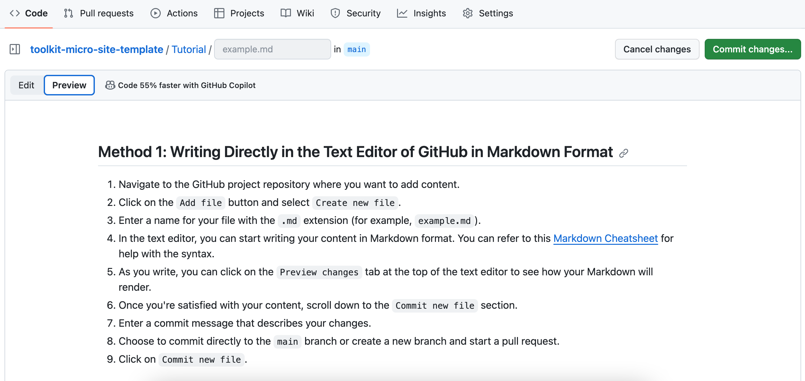

## Method 1: Writing Directly in the Text Editor of GitHub in Markdown Format

1. Navigate to the GitHub project repository where you want to add content.
2. Click on the `Add file` button and select `Create new file`.
3. Enter a name for your file with the `.md` extension (for example, `example.md`).
4. In the text editor, you can start writing your content in Markdown format. You can refer to this [Markdown Cheatsheet](https://github.com/adam-p/markdown-here/wiki/Markdown-Cheatsheet) for help with the syntax.

5. As you write, you can click on the `Preview changes` tab at the top of the text editor to see how your Markdown will render.

6. Once you're satisfied with your content, `Commit` the file or changes you have made to the file.
7. Enter a commit message that describes your changes.
8. Choose to commit directly to the `main` or your branch and start a pull request.
9. Click on `Commit new file`.
